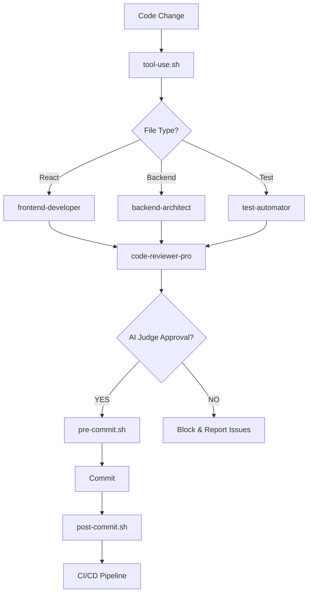

# Claude Code Hooks System

This directory contains hooks that enable autonomous development workflows with Claude Code. Hooks are shell scripts that execute automatically in response to specific events during the development process.

## Overview

The hooks system provides:
- **Automated quality gates** before commits
- **Intelligent code review** via AI agents
- **Continuous testing** and validation
- **Deployment orchestration** with safety checks

## Available Hooks

### 1. `pre-commit.sh`
**Triggers:** Before every git commit
**Purpose:** Quality gate to ensure code meets standards before committing

**What it does:**
- Runs `pnpm lint --fix` to auto-format code
- Executes TypeScript type checking
- Runs fast unit tests (skips E2E)
- Invokes AI code quality judge (in high autonomy mode)
- **BLOCKS commit** if any check fails

**Exit codes:**
- `0`: All checks passed, commit proceeds
- `1`: Quality gate failed, commit blocked

**Example output:**
```
🔍 Pre-commit Quality Gate Starting...
📝 Running linter...
✓ Linting passed
🔤 Running TypeScript type check...
✓ Type check passed
🧪 Running fast unit tests...
✓ Tests passed
✅ Quality gate PASSED - proceeding with commit
```

### 2. `post-commit.sh`
**Triggers:** After successful git commit
**Purpose:** Log commits and optionally trigger CI/CD

**What it does:**
- Logs commit details (branch, hash, message)
- Detects auto-generated commits
- Suggests `git push` for main branches
- Logs to `.claude/.commit-history.log` for agent tracking

**Auto-push (future):**
In high autonomy mode, this will automatically push to remote branches:
```bash
git push origin $CURRENT_BRANCH
```

### 3. `tool-use.sh`
**Triggers:** After Edit/Write tool operations in Claude Code
**Purpose:** Automatically review code changes with appropriate sub-agent

**What it does:**
- Detects file type (.tsx, .ts, server/, test files)
- Suggests appropriate sub-agent for review:
  - React components → `frontend-developer`
  - Backend files → `backend-architect`
  - TypeScript → `typescript-pro`
  - Test files → `test-automator`
  - General → `code-reviewer-pro`
- Auto-formats the file (if prettier available)
- Runs quick type check for TS files
- Logs to `.claude/.tool-use.log`

**Future:** Will automatically invoke sub-agents in high autonomy mode

### 4. `test-result.sh`
**Triggers:** After test execution completes
**Purpose:** Analyze test results and determine next actions

**What it does:**
- Parses test exit code (0 = pass, non-zero = fail)
- On **SUCCESS**:
  - Logs to test history
  - Signals ready for deployment gate
  - (Future) Invokes `qa-expert` for E2E validation
- On **FAILURE**:
  - Extracts failed test details
  - (Future) Invokes `debugger` agent to analyze
  - **BLOCKS deployment**
- Displays code coverage if available

**Usage:**
```bash
pnpm test
.claude/hooks/test-result.sh $? .claude/.last-test-output.log
```

## Hook Configuration

### Enabling Hooks

Hooks are configured in `.claude/settings.local.json`:

```json
{
  "hooks": {
    "PreToolUse": [
      {
        "matcher": "Bash",
        "hooks": [{
          "command": "\"$CLAUDE_PROJECT_DIR\"/.claude/hooks/tool.bash.block.sh \"$COMMAND\"",
          "blockOnFailure": true
        }]
      }
    ],
    "PostToolUse": [
      {
        "matcher": "Edit|Write",
        "hooks": [{
          "command": "\"$CLAUDE_PROJECT_DIR\"/.claude/hooks/tool-use.sh \"$FILE_PATH\""
        }]
      }
    ],
    "UserPromptSubmit": [
      {
        "hooks": [{
          "command": "\"$CLAUDE_PROJECT_DIR\"/.claude/hooks/user-prompt-submit.sh \"$USER_MESSAGE\""
        }]
      }
    ]
  },
  "autonomy": {
    "level": "high",
    "auto_commit": true,
    "auto_test": true,
    "auto_deploy": true,
    "quality_gate": "ai-judge"
  }
}
```

**IMPORTANT**: Always use `"$CLAUDE_PROJECT_DIR"` for hook paths. This ensures hooks work regardless of the current working directory. Never use relative paths like `.claude/hooks/script.sh` as they will fail when Claude Code's working directory is not the project root.

### Autonomy Levels

**Low (Manual):**
- Hooks run but only provide suggestions
- No automated actions
- Human approval required for all operations

**Medium (Assisted):**
- Hooks auto-fix minor issues (formatting, linting)
- Automated testing
- Human approval for commits and deploys

**High (Autonomous):** ⚡ **ACTIVE** - Default Mode
- Hooks automatically invoke specialized agents
- Agents chain together without user permission
- Auto-fix all fixable issues
- AI code-reviewer-pro makes quality decisions
- Optional: Auto-commit, auto-test, auto-deploy
- Human notified of all actions via progress reports

## Log Files

Hooks generate logs in `.claude/`:

| Log File | Purpose |
|----------|---------|
| `.commit-history.log` | All commits with timestamps |
| `.tool-use.log` | File modifications and agent suggestions |
| `.test-history.log` | Test pass/fail history |
| `.last-test-output.log` | Latest test execution output |

## Integration with Sub-Agents

Hooks coordinate with specialized sub-agents:



## Testing Hooks

### Manual Testing

Test each hook individually:

```bash
# Test pre-commit hook
.claude/hooks/pre-commit.sh

# Test post-commit hook (after a commit)
.claude/hooks/post-commit.sh

# Test tool-use hook with a file
.claude/hooks/tool-use.sh src/components/Button.tsx

# Test test-result hook
pnpm test
.claude/hooks/test-result.sh $?
```

### Integration Testing

Commit with hooks enabled:
```bash
git add .
git commit -m "test: verify hooks working"
# Hooks will execute automatically
```

## Troubleshooting

### Hook Failing with "No such file or directory" (Error 127)

**Symptom**: Hooks fail with error 127 and message like:
```
PreToolUse:Bash [.claude/hooks/tool.bash.block.sh] failed with status code 127:
/bin/sh: .claude/hooks/tool.bash.block.sh: No such file or directory
```

**Cause**: Hook is configured with relative path instead of using `$CLAUDE_PROJECT_DIR`

**Fix**: Update all hook commands in `.claude/settings.local.json` to use `$CLAUDE_PROJECT_DIR`:
```json
// ❌ WRONG - Relative path
"command": ".claude/hooks/tool.bash.block.sh \"$COMMAND\""

// ✅ CORRECT - Absolute path using environment variable
"command": "\"$CLAUDE_PROJECT_DIR\"/.claude/hooks/tool.bash.block.sh \"$COMMAND\""
```

The `$CLAUDE_PROJECT_DIR` environment variable contains the absolute path to your project root, ensuring hooks work regardless of the current working directory.

### Hook Not Executing

1. Check permissions: `ls -la .claude/hooks/`
2. Make executable: `chmod +x .claude/hooks/*.sh`
3. Check hook configuration in `.claude/settings.local.json`
4. Verify hook paths use `$CLAUDE_PROJECT_DIR` (see above)

### Hook Blocking Commits

If a hook blocks your commit:
1. Read the error output carefully
2. Fix the reported issues (linting, type errors, test failures)
3. Try committing again
4. **Emergency bypass** (use sparingly):
   ```bash
   git commit --no-verify -m "urgent fix"
   ```

### AI Judge Rejecting Code

When AI quality judge rejects code:
1. Review the specific issues reported
2. Common blockers:
   - Type errors or `any` types
   - Missing test coverage
   - Security vulnerabilities
   - Performance concerns
3. Fix issues and re-attempt commit

## Autonomous Execution Flow

When `AUTONOMY_LEVEL=high` (default), the system operates as follows:

### 1. Code Change Detected
```
User: "Create a login component"
  ↓
Main Agent: Delegates to frontend-developer
  ↓
tool-use.sh hook detects Edit/Write
  ↓
Hook outputs: "AUTO-REVIEW TRIGGERED - Invoke code-reviewer-pro"
  ↓
Main Agent: Automatically invokes code-reviewer-pro
  ↓
code-reviewer-pro: Reviews, finds issues
  ↓
Main Agent: Fixes issues automatically (no permission needed)
  ↓
Main Agent: Re-runs code-reviewer-pro
  ↓
code-reviewer-pro: Approves ✓
  ↓
Main Agent: Reports completion to user
```

**No user intervention required unless critical issues found**

### 2. Multi-Phase Projects
```
User: "Implement user authentication (database + API + UI)"
  ↓
Phase 1: Database migration
  ↓ (AUTO-CONTINUE)
Phase 2: API endpoints
  ↓ (AUTO-CONTINUE)
Phase 3: Frontend UI
  ↓ (AUTO-CONTINUE)
Phase 4: E2E tests
  ↓
Report all results to user
```

**Agent chains automatically without asking "Would you like to proceed?"**

## Future Enhancements

### Phase 2: Advanced Agent Communication ✅ LARGELY COMPLETE
- ✓ Fully automated sub-agent invocation
- ✓ Agent-to-agent chaining via hooks
- 🚧 Shared context/artifact passing between agents

### Phase 3: Advanced Quality Gates
- Visual regression testing
- Performance benchmarking
- Security scanning (OWASP, secrets detection)

### Phase 4: Deployment Automation
- Blue-green deployments
- Automated rollback on failure
- Production health monitoring

## Best Practices

1. **Don't bypass hooks** unless absolutely necessary
2. **Review hook logs** regularly to understand agent behavior
3. **Update hooks** as project needs evolve
4. **Test hooks** after any modifications
5. **Monitor autonomy** - ensure AI decisions align with human intent

## Getting Help

- Documentation: `.claude/hooks/README.md` (this file)
- Agent specs: `.claude/agents/`
- Settings: `.claude/settings.local.json`
- Logs: `.claude/*.log`

For issues or questions, review the hook output and logs first. The hooks are designed to provide clear, actionable feedback.

---

**Version:** 2.0.0 (Phase 2: Autonomous Agent Chaining)
**Last Updated:** 2025-10-09
**Status:** ✅ Active (Autonomous execution enabled, AI judge operational)
