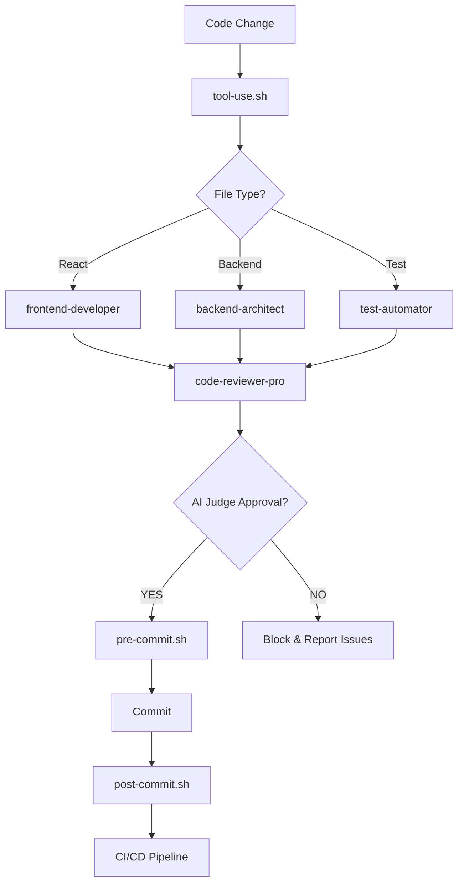

# Claude Code Hooks System

This directory contains hooks that enable autonomous development workflows with Claude Code. Hooks are shell scripts that execute automatically in response to specific events during the development process.

## Overview

The hooks system provides:
- **Automated quality gates** before commits
- **Intelligent code review** via AI agents
- **Continuous testing** and validation
- **Deployment orchestration** with safety checks

## Available Hooks

### 1. `pre-commit.sh`
**Triggers:** Before every git commit
**Purpose:** Quality gate to ensure code meets standards before committing

**What it does:**
- Runs `pnpm lint --fix` to auto-format code
- Executes TypeScript type checking
- Runs fast unit tests (skips E2E)
- Invokes AI code quality judge (in high autonomy mode)
- **BLOCKS commit** if any check fails

**Exit codes:**
- `0`: All checks passed, commit proceeds
- `1`: Quality gate failed, commit blocked

**Example output:**
```
🔍 Pre-commit Quality Gate Starting...
📝 Running linter...
✓ Linting passed
🔤 Running TypeScript type check...
✓ Type check passed
🧪 Running fast unit tests...
✓ Tests passed
✅ Quality gate PASSED - proceeding with commit
```

### 2. `post-commit.sh`
**Triggers:** After successful git commit
**Purpose:** Log commits and optionally trigger CI/CD

**What it does:**
- Logs commit details (branch, hash, message)
- Detects auto-generated commits
- Suggests `git push` for main branches
- Logs to `.claude/.commit-history.log` for agent tracking

**Auto-push (future):**
In high autonomy mode, this will automatically push to remote branches:
```bash
git push origin $CURRENT_BRANCH
```

### 3. `tool-use.sh`
**Triggers:** After Edit/Write tool operations in Claude Code
**Purpose:** Automatically review code changes with appropriate sub-agent

**What it does:**
- Detects file type (.tsx, .ts, server/, test files)
- Suggests appropriate sub-agent for review:
  - React components → `frontend-developer`
  - Backend files → `backend-architect`
  - TypeScript → `typescript-pro`
  - Test files → `test-automator`
  - General → `code-reviewer-pro`
- Auto-formats the file (if prettier available)
- Runs quick type check for TS files
- Logs to `.claude/.tool-use.log`

**Future:** Will automatically invoke sub-agents in high autonomy mode

### 4. `test-result.sh`
**Triggers:** After test execution completes
**Purpose:** Analyze test results and determine next actions

**What it does:**
- Parses test exit code (0 = pass, non-zero = fail)
- On **SUCCESS**:
  - Logs to test history
  - Signals ready for deployment gate
  - (Future) Invokes `qa-expert` for E2E validation
- On **FAILURE**:
  - Extracts failed test details
  - (Future) Invokes `debugger` agent to analyze
  - **BLOCKS deployment**
- Displays code coverage if available

**Usage:**
```bash
pnpm test
.claude/hooks/test-result.sh $? .claude/.last-test-output.log
```

### 5. `post-milestone.sh`
**Triggers:** After completing major work phases (manual or automated)
**Purpose:** Automate commit, push, PR creation, documentation, and context cleanup

**What it does:**
- Stages and commits all changes with auto-generated message
- Pushes to remote repository
- Documents changes in work log (`.claude/.work-log.md`)
- Archives artifacts to `.claude/.archive/{timestamp}/`
- Clears `.claude/artifacts/` for next phase
- Updates scratchpad with session notes
- Provides summary of milestone completion

**When to use:**
- After completing a major feature
- Finishing a sprint task or milestone
- End of a significant refactoring
- Before transitioning to next work phase

**Manual trigger:**
```bash
.claude/hooks/post-milestone.sh
```

**Auto-trigger (future):**
Can be configured to run automatically when:
- All tests pass after major changes
- Specific commit message patterns detected
- Manual flag in `.claude/.milestone-ready` file

**Example output:**
```
🏁 Post-Milestone Hook Starting...
📝 Analyzing changes for commit message...
✓ Detected change type: feat(ui)
✓ Summary: 8 files changed, 234 insertions(+), 45 deletions(-)
📦 Staging all changes...
📝 Creating commit...
✓ Commit created successfully
⬆️  Pushing to remote...
✓ Pushed to origin/feature/dark-mode
📚 Documenting changes...
✓ Work log updated
📁 Archiving artifacts...
✓ Artifacts archived to .claude/.archive/2025-10-10-14-23/
🧹 Clearing artifacts for next phase...
✓ Artifacts cleared
📝 Updating scratchpad...
✓ Scratchpad updated

━━━━━━━━━━━━━━━━━━━━━━━━━━━━━━━━━━━━━━━━
🎉 Milestone Completion Summary
━━━━━━━━━━━━━━━━━━━━━━━━━━━━━━━━━━━━━━━━
✓ Changes committed and pushed
✓ Work documented in .claude/.work-log.md
✓ Artifacts archived to .claude/.archive/2025-10-10-14-23/
✓ Context cleared for next phase
✓ Scratchpad updated with next actions
━━━━━━━━━━━━━━━━━━━━━━━━━━━━━━━━━━━━━━━━
```

### 6. `post-agent-execution.sh`
**Triggers:** After each agent completes
**Purpose:** Force garbage collection to prevent memory accumulation

**What it does:**
- Runs memory cleanup utility
- Forces GC between agent invocations
- Prevents memory crashes with multiple agents
- Logs memory cleanup status

**Critical for:**
- Preventing heap out of memory errors
- Sequential agent execution
- Long-running automated workflows

## Hook Configuration

### Enabling Hooks

Hooks are configured in `.claude/settings.local.json`:

```json
{
  "hooks": {
    "pre-commit": ".claude/hooks/pre-commit.sh",
    "post-commit": ".claude/hooks/post-commit.sh",
    "post-milestone": ".claude/hooks/post-milestone.sh",
    "post-agent-execution": ".claude/hooks/post-agent-execution.sh",
    "tool-use": ".claude/hooks/tool-use.sh",
    "test-result": ".claude/hooks/test-result.sh"
  },
  "autonomy": {
    "level": "high",
    "auto_commit": true,
    "auto_test": true,
    "auto_deploy": true,
    "quality_gate": "ai-judge"
  }
}
```

### Autonomy Levels

**Low (Manual):**
- Hooks run but only provide suggestions
- No automated actions
- Human approval required for all operations

**Medium (Assisted):**
- Hooks auto-fix minor issues (formatting, linting)
- Automated testing
- Human approval for commits and deploys

**High (Autonomous):** ⚡ Current Target
- Hooks auto-fix all fixable issues
- AI judge makes quality decisions
- Auto-commit, auto-test, auto-deploy
- Human notified of all actions

## Log Files

Hooks generate logs in `.claude/`:

| Log File | Purpose |
|----------|---------|
| `.commit-history.log` | All commits with timestamps |
| `.tool-use.log` | File modifications and agent suggestions |
| `.test-history.log` | Test pass/fail history |
| `.last-test-output.log` | Latest test execution output |
| `.work-log.md` | Milestone completions and session notes |
| `.scratchpad.md` | Current session notes and next actions |
| `.archive/{timestamp}/` | Archived artifacts from completed milestones |

## Integration with Sub-Agents

Hooks coordinate with specialized sub-agents:



## Testing Hooks

### Manual Testing

Test each hook individually:

```bash
# Test pre-commit hook
.claude/hooks/pre-commit.sh

# Test post-commit hook (after a commit)
.claude/hooks/post-commit.sh

# Test tool-use hook with a file
.claude/hooks/tool-use.sh src/components/Button.tsx

# Test test-result hook
pnpm test
.claude/hooks/test-result.sh $?

# Test post-milestone hook
.claude/hooks/post-milestone.sh

# Test post-agent-execution hook
.claude/hooks/post-agent-execution.sh
```

### Integration Testing

Commit with hooks enabled:
```bash
git add .
git commit -m "test: verify hooks working"
# Hooks will execute automatically
```

## Troubleshooting

### Hook Not Executing

1. Check permissions: `ls -la .claude/hooks/`
2. Make executable: `chmod +x .claude/hooks/*.sh`
3. Check hook configuration in `.claude/settings.local.json`

### Hook Blocking Commits

If a hook blocks your commit:
1. Read the error output carefully
2. Fix the reported issues (linting, type errors, test failures)
3. Try committing again
4. **Emergency bypass** (use sparingly):
   ```bash
   git commit --no-verify -m "urgent fix"
   ```

### AI Judge Rejecting Code

When AI quality judge rejects code:
1. Review the specific issues reported
2. Common blockers:
   - Type errors or `any` types
   - Missing test coverage
   - Security vulnerabilities
   - Performance concerns
3. Fix issues and re-attempt commit

## Future Enhancements

### Phase 2: Sub-Agent Integration
- Fully automated sub-agent invocation
- Agent-to-agent communication
- Task queue coordination

### Phase 3: Advanced Quality Gates
- Visual regression testing
- Performance benchmarking
- Security scanning (OWASP, secrets detection)

### Phase 4: Deployment Automation
- Blue-green deployments
- Automated rollback on failure
- Production health monitoring

## Best Practices

1. **Don't bypass hooks** unless absolutely necessary
2. **Review hook logs** regularly to understand agent behavior
3. **Update hooks** as project needs evolve
4. **Test hooks** after any modifications
5. **Monitor autonomy** - ensure AI decisions align with human intent

## Getting Help

- Documentation: `.claude/hooks/README.md` (this file)
- Agent specs: `.claude/agents/`
- Settings: `.claude/settings.local.json`
- Logs: `.claude/*.log`

For issues or questions, review the hook output and logs first. The hooks are designed to provide clear, actionable feedback.

---

**Version:** 1.0.0 (Phase 1: Hooks Foundation)
**Last Updated:** 2025-10-07
**Status:** 🚧 In Development (Manual triggers, AI judge in planning)
